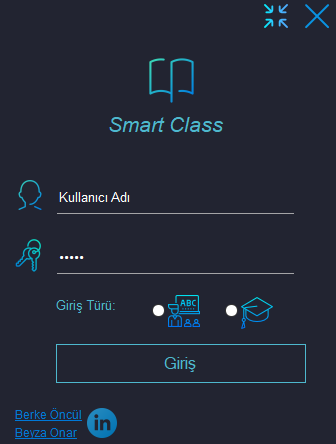
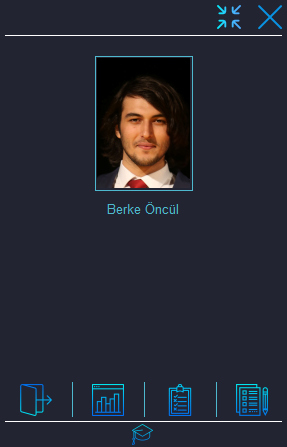
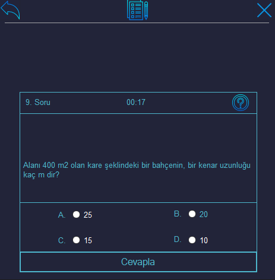
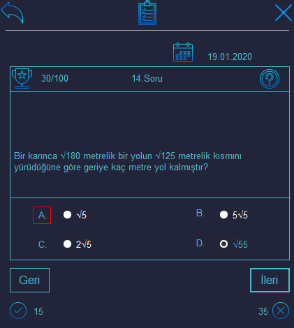
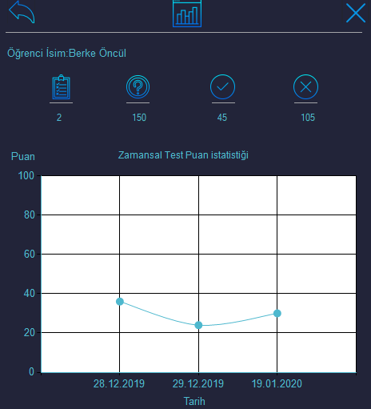
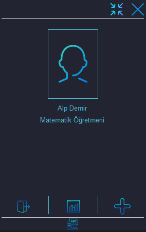
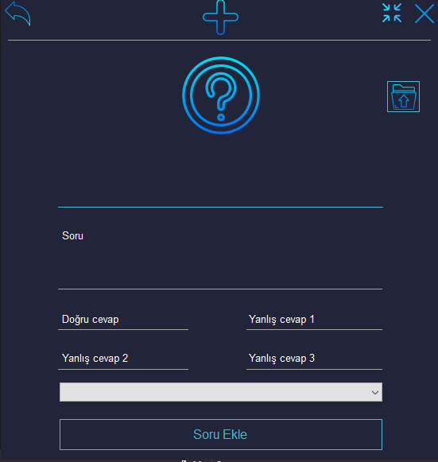

# SmartClass

Class Automation System

Description:
SmartClass is a class automation system, that means students can take tests, see their tests' results anytime and view their statistics.
SmartClass makes tests automaticcaly according to the students' statistics, if they are doing really bad on a subject then that subject will be asked more than the others. The aim here is to solve subjects where they are weakest and try to improve.
Teachers can add questions and view students' statistics to see how they are doing.

Login form

# Student section

Student Main Form

Student Test Form

Student Results Form

Student Statistics Form

# Teacher section

Teacher Main Form

Teacher Add Question Form

Icons that are used in this application are made by srip from https://www.flaticon.com

